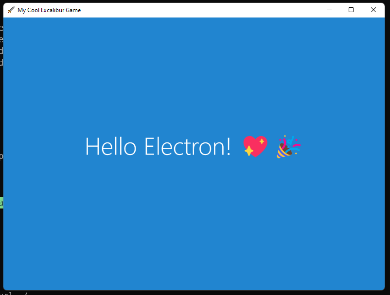

# Excalibur Electron Example

This example shows how to use [Electron](https://www.electronjs.org/docs/latest/) to distribute your Excalibur game 
to Mac, Linux, and PC desktops!




If you need access to the dev tools comment out remove menu, and uncomment the dev tools

```typescript
  // Remove menu
  mainWindow.removeMenu();

  // Open the DevTools.
  // mainWindow.webContents.openDevTools();
```

## Launch

    # Install dependencies
    npm install

    # Run locally
    npm start

    # Package for distribution (run as administrator)
    npm run build

## Updating Test Snapshots

* Windows

   ```powershell
   npm run test:update-snapshot
   ```

* Linux for CI

   ```powershell
   docker run --rm --network host -v C:\projects\template-electron:/work/ -w /work/ -it mcr.microsoft.com/playwright:v1.41.2-jammy /bin/bash
   npm install
   xvfb-run --auto-servernum --server-args="-screen 0 1280x960x24" -- npm run test:update-snapshot
   ```
   

## Notes

The game files are compiled via TypeScript in the **src** folder. You could easily use a bundler 
like [parcel](https://github.com/excaliburjs/template-ts-parcel-v2) to bundle Excalibur and your game 
into one file.
